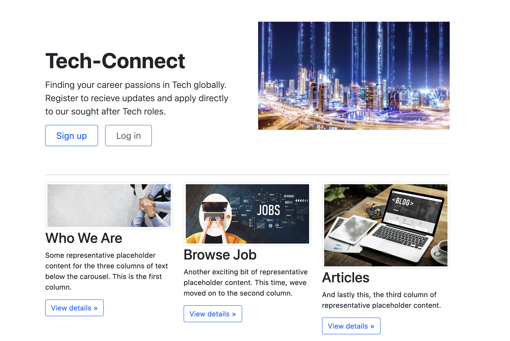
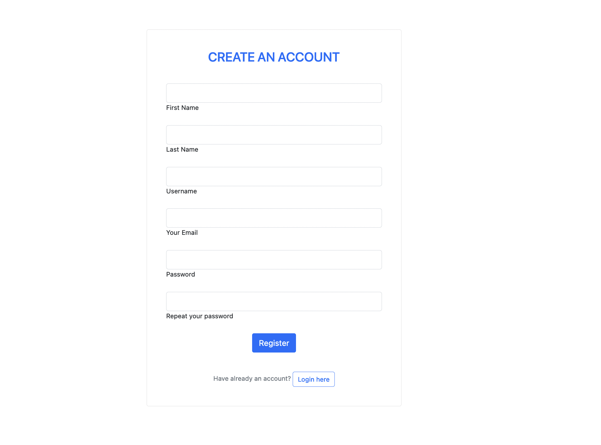
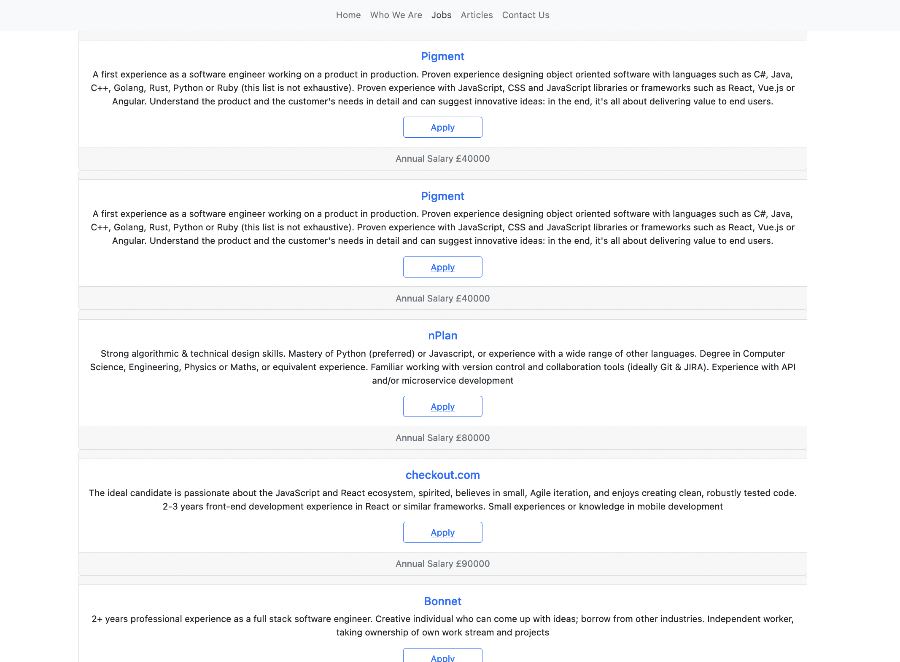

# Tech-Connect #

## General Assembly SEI | Project Four | Figma/ Python / Django / TablePlus / React / Bootstrap / CSS | Solo | 1 Week ##

Link to game: https://techconnect.netlify.app/

### Overview ###

Tech-Connect is a full-stack web app for a made-up tech recruitment company. Users can create authenticated profiles and apply to jobs directly from the site. They could also read blog posts about general tech career advice. Admins can create and delete jobs and blog posts as well as users through Django's admin page. 

## Project Brief & MVP ##

• Create a full-stack Web App using Python / Django / TablePlus / React

• Hook up front & backend 

• Include a functional front-end  

• Build a server using Django and make requests for it 

• KISS and DRY Code

• Deploy for public access.

## Technologies Used ##

• Figma

• Python

• Django 

• TablePlus

• React 

• Bootstrap

• CSS

## Planning ##

I used Figma to plan this project. I thoroughly thought through what I wanted the app to achieve overall and what needed to be included in my server as well as what schemas I would require to correctly make the right pull requests on the front.

 On the front-end, I planned everything from what pages I needed to style inspirations though I chose not to stick to some of the original ideas as I preferred the professional style of the Webapp in the end. 

 I was really pleased with the outcome given the timeframe we had to achieve this. I chose to go solo on this final project as I wanted to piece what I had learnt together and put it into practice.

  

## Back-end process ##

I began by building my server and ensuring my backend has all the data I need to be pulled once working on the front. I started by creating the schemas and routes needed then proceeded with adding authentication.


I had three models in total, a model for jobs, a model for users and a model for blogs.

```py
class Jobs(models.Model):
    ''' Jobs Model '''
    title = models.CharField(max_length=500, unique=False)
    company_name = models.CharField(max_length= 500, unique=False)
    job_description = models.CharField(max_length=5000, unique=False)
    salary = models.PositiveIntegerField(unique=False)
    created_at = models.DateField(auto_now_add=True)

    def __str__(self):
        return f'{self.title}'
```
Users Model:

```py
class User(AbstractUser):
    email = models.CharField(max_length=50)
```

Blogs Model:

```py
class Blogs(models.Model):
    ''' Blogs Model'''
    title = models.CharField(max_length=5000, unique=False)
    content = models.CharField(max_length=10000, unique=False)
    image = models.CharField(max_length=300, unique=False)

    def __str__(self):
        return f'{self.title}'
```
I also built as the serializers needed for my models and seeded all my data while using TablePlus to test before entry.

Authentication:
```py
class JWTAuthentication(BasicAuthentication):

    def authenticate(self, request):
        header = request.headers.get('Authorization')

        if not header:
            return None

        if not header.startswith('Bearer'):
            raise PermissionDenied({'detail':'Invalid Auth Header'})

        token = header.replace('Bearer ', '')

        try:
            payload = jwt.decode(token, settings.SECRET_KEY, algorithms=['HS256'])
            user = User.objects.get(pk=payload.get('sub'))
        except jwt.exceptions.InvalidTokenError:
            raise PermissionDenied({'detail':'Invalid Token Error'})
        except User.DoesNotExist:
            raise PermissionDenied({'detail':'User Not Found'})

        return (user, token)
```

## Front-End process ##

I began by creating my setuproxy to ensure the requests are pointed at the right API. Then I did my routing using react-router-dom. I like to create my pages before I fill them with content. I usually set up the routes and files then add in small function that displays something like 
```js
<h1> This is the HomePage </h1>

```
I then work on the pages individually.

To get the jobs data I wrote the following function:

```js
function Jobs (){
  const [jobs, setJobs] = React.useState(null)
  const [isError, setIsError] = React.useState(false)
  const isLoading = !jobs && !isError

  React.useEffect(() => {
    const getData = async () => {
      try {
        const res = await getAllJobs()
        setJobs(res.data)
      } catch (err) {
        setIsError(true)
      }
    }
    getData()
  }, [])
```
Then displayed them as follows:

```js
  <JobCard
              key={job.id}
              jobId={job.id}
              companyName={job.companyName}
              jobDescription={job.jobDescription}
              salary={job.salary}
              createdAt={job.createdAt}
            />
```

## Screenshots ##

**Landing page:**

 

**Sign Up page**

 

**Blogs page:** 


**Jobs page:**




## Challenges ##

My main challenge was getting my authentication in Django to behave correctly and assigning which routes require tokens for access. After a lot of errors and problem solving I managed to get it to work correctly. Remembering to dump data and reseed after changes was an adjustment in Django too. 

## Wins ##

Building a full-stack app with Python, Django and React on my own was a massive win for me. Finding the correct answers to the problems I was facing was also a win. I was comfortable enough to not need a lot of assistance with this project. 

## Key Learnings ##

• Django is a great framework but gets a little tricky if you try to adjust some of its built in functions

• Planning thoroughly leads to less errors and trouble while coding regardless of how large a project is.

## Future Features ## 
• "Save job" feature to allow users to bookmark jobs to access later

• A profile section for users that allows them to change account details and view saved jobs and articles. 

• A "send" feature that allows users to send jobs to other authenticated users.


